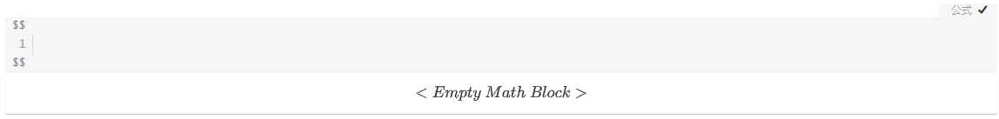
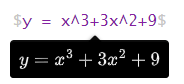

# Typora和LaTex的梦幻联动

**LaTex——一个及其复杂的排版工具（好吧，可能也是我学不会的借口）！所以我们要用Typora和LaTex比一比（其实是因为typora付费了，不用就可惜了）。**

## 1.打开Typora选择数学模块

- 点击“段落”$\rightarrow$"公式块"
- 快捷键Ctrl+shift+m
- “$$”+Enter

以上三种方式都能打开数学公式的编辑栏，如下：




## 2.添加数学公式

输出美观规范的数学公式，要清楚它们的格式和代码，在编辑栏中输入代码，对应的公式会在下面实时显示，例如：



## 3.typora公式编辑语法

### 基本格式

1. **上下标**

$$
A_1^2
\\
B_{12}
\\
2^{x^2+y}
$$

```txt
A_1^2
\\
B_{12}
\\
2^{x^2+y}
```

2. **分数**

$$
\frac{x}{1+x^2}
\\
\frac{\frac{1}{2}+x}{y}
\\
\dfrac{a}{b}(无论在行间还是行内都打印显示模式)
\\
\tfrac{a}{b}(无论在行内还是行间都打印文本模式)
$$

```txt
\frac{x}{1+x^2}
\\
\frac{\frac{1}{2}+x}{y}
\\
\dfrac{a}{b}(无论在行间还是行内都打印显示模式)
\\
\tfrac{a}{b}(无论在行内还是行间都打印文本模式)
```

3. **开根**

$$
\sqrt{3}
\\
\sqrt[3]{3}
$$

```txt
\sqrt{3}
\\
\sqrt[3]{3}
```

4. **组合数**

$$
\binom{a}{b}
\\
\dbinom{2}{3}(无论在行间还是行内都打印显示模式)
\\
\tbinom{2}{3}(无论在行内还是行间都打印文本模式)
$$

```txt
\binom{a}{b}
\\
\dbinom{2}{3}(无论在行间还是行内都打印显示模式)
\\
\tbinom{2}{3}(无论在行内还是行间都打印文本模式)
```

5. **导数**

$$
a' \\ a'' \\ a^{\prime}
$$

```txt
a' 
\\ 
a'' 
\\ 
a^{\prime}
```

6. **取模**

$$
x\pmod{a}
\\
2\mod{x}
$$


```txt
x\pmod{a}
\\
2\mod{x}
```

7. **积分**

$$
\int_1^2 
\intop_2^1 
\oint 
\smallint 
\\
\iint
\oiint
\iiint
\oiiint
\iiiint
$$

```txt
\int_1^2 
\intop_2^1 
\oint 
\smallint 
\\
\iint
\oiint
\iiint
\oiiint
\iiiint
```

8. **累加/累乘/极限**

$$
\sum_{i=1}^{k}
\\
\displaystyle\sum_{i=1}^n(无论在行间还是行内都打印显示模式)
\\
\textstyle\sum_{i=1}^n(无论在行间还是行内都打印文本模式)
\\
\prod_{i=1}^{k}
\\
\displaystyle\prod_{i=1}^n(无论在行间还是行内都打印显示模式)
\\
\textstyle\prod_{i=1}^n(无论在行间还是行内都打印文本模式)
\\
\lim_{k \to \infty}
\lim_{k \rightarrow \infty}
\\
\lim\limits_{k \to \infty}
\lim\limits_{k \rightarrow \infty}
(限制上下限位置，用于行间)
\\
\lim\nolimits_{k \to \infty}
\lim\nolimits_{k \rightarrow \infty}
(限制上下限位置，用于行内)
$$

```txt
\sum_{i=1}^{k}
\\
\displaystyle\sum_{i=1}^n(无论在行间还是行内都打印显示模式)
\\
\textstyle\sum_{i=1}^n(无论在行间还是行内都打印文本模式)
\\
\prod_{i=1}^{k}
\\
\displaystyle\prod_{i=1}^n(无论在行间还是行内都打印显示模式)
\\
\textstyle\prod_{i=1}^n(无论在行间还是行内都打印文本模式)
\\
\lim_{k \to \infty}
\lim_{k \rightarrow \infty}
\\
\lim\limits_{k \to \infty}
\lim\limits_{k \rightarrow \infty}
(限制上下限位置，用于行间)
\\
\lim\nolimits_{k \to \infty}
\lim\nolimits_{k \rightarrow \infty}
(限制上下限位置，用于行内)
```

### 修饰符号(上下头标)

1. **简单的帽子**

$$
\hat{\theta}
\quad
\widehat{AB}
\\
\bar{\theta}
\quad
\overline{AB}
\\
\tilde{\theta}
\quad
\widetilde{AB}
\\
\bar{a}
\acute{a}
\check{a}
\grave{a}
\quad
\dot{a}
\quad
\ddot{a}
\quad
\dddot{a}
\quad
\ddddot{a}
$$

```txt
\hat{\theta}
\quad
\widehat{AB}
\\
\bar{\theta}
\quad
\overline{AB}
\\
\tilde{\theta}
\quad
\widetilde{AB}
\\
\bar{a}
\acute{a}
\check{a}
\grave{a}
\quad
\dot{a}
\quad
\ddot{a}
\quad
\dddot{a}
\quad
\ddddot{a}
```

2. **帽子和袜子**

$$
\overleftarrow{AB}
\ 
\overrightarrow{AB}
\
\overleftrightarrow{AB}
\\
\underleftarrow{AB}
\ 
\underrightarrow{AB}
\
\underleftrightarrow{AB}
\\
\overbrace{ABC}
\
\underbrace{ABC}
\\
\overline{ABC}
\
\underline{ABC}
$$

```txt
\overleftarrow{AB}
\ 
\overrightarrow{AB}
\
\overleftrightarrow{AB}
\\
\underleftarrow{AB}
\ 
\underrightarrow{AB}
\
\underleftrightarrow{AB}
\\
\overbrace{ABC}
\
\underbrace{ABC}
\\
\overline{ABC}
\
\underline{ABC}
```

3. **盖子和盒子**

$$
\overbrace{a+b+c}^{top}_{under}
\\
\underbrace{a+b+c}^{top}_{under}
\\
\boxed{\pi=3.14 \cdots}
$$

```txt
\overbrace{a+b+c}^{top}_{under}
\\
\underbrace{a+b+c}^{top}_{under}
\\
\boxed{\pi=3.14 \cdots}
```

### 各种括号

$$
( [ \{
\\
\big( \big[ \big\{
\\
\Big( \Big[ \Big\{
\\
\bigg( \bigg[ \bigg\{
\\
\Bigg( \Bigg[ \Bigg\{
$$

```txt
( [ \{
\\
\big( \big[ \big\{
\\
\Big( \Big[ \Big\{
\\
\bigg( \bigg[ \bigg\{
\\
\Bigg( \Bigg[ \Bigg\{
```

$$
[2]
<2>
|2|
\{2\}
$$

```txt
[2]
<2>
|2|
\{2\}
```

$$
\lgroup x \rgroup
\lvert a \rvert
\lVert a \rVert
\lceil a \rceil
\lfloor a \rfloor
$$

```txt
\lgroup x \rgroup
\lvert a \rvert
\lVert a \rVert
\lceil a \rceil
\lfloor a \rfloor
```

$$
\ulcorner
\urcorner
\llcorner
\lrcorner
$$

```txt
\ulcorner
\urcorner
\llcorner
\lrcorner
```

### 希腊字母

$$
| \alpha | \nu | \Delta | \varPsi | \chi |\Omega |\lambda || \varphi | \delta | \omega | \imath | \beta | \epsilon | \Pi |
\\
| \zeta | \varkappa | \vartheta | \omicron | \Lambda | \theta | \varpi | \jmath | \gamma | \varepsilon | \Psi | \kappa | \varsigma | \varSigma |
\\
| \tau | \Upsilon | \mu | \digamma | \aleph | \phi | \varrho | \varDelta | \xi | \Theta | \varOmega | \psi | \varLambda | \pi | \partial | \hbar |
$$

```txt
| \alpha | \nu | \Delta | \varPsi | \chi |\Omega |\lambda || \varphi | \delta | \omega | \imath | \beta | \epsilon | \Pi |
\\
| \zeta | \varkappa | \vartheta | \omicron | \Lambda | \theta | \varpi | \jmath | \gamma | \varepsilon | \Psi | \kappa | \varsigma | \varSigma |
\\
| \tau | \Upsilon | \mu | \digamma | \aleph | \phi | \varrho | \varDelta | \xi | \Theta | \varOmega | \psi | \varLambda | \pi | \partial | \hbar |
```

### 算数运算符

$$
+
-
\times
/
\div
\cdot
\
\%
$$

```txt
+
-
\times
/
\div
\cdot
\
\%
```

$$
\cap
\cup
\land
\lor
\sqcap
\sqcup
$$

```txt
\cap
\cup
\land
\lor
\sqcap
\sqcup
```

$$
\circ
\ast
\star
\otimes
\oplus
\odot
$$

```txt
\circ
\ast
\star
\otimes
\oplus
\odot
```

$$
\pm
\mp
\dotplus
\divideontimes
$$

```txt
\pm
\mp
\dotplus
\divideontimes
```

### 比较运算符

$$
\not
\\
=
\not=
\equiv
\not\equiv
\approx
\not\approx
\approxeq
\not\approxeq
\cong
\not\cong
\sim
\not\sim
$$

```txt
\not
\\
=
\not=
\equiv
\not\equiv
\approx
\not\approx
\approxeq
\not\approxeq
\cong
\not\cong
\sim
\not\sim
```

$$
<
>
\le
\ge
\ll
\gg
\lll
\ggg
$$

```txt
<
>
\le
\ge
\ll
\gg
\lll
\ggg
```

$$
\curlyeqprec
\curlyeqsucc
\prec
\succ
\preceq
\succeq
$$

```txt
\curlyeqprec
\curlyeqsucc
\prec
\succ
\preceq
\succeq
```

### 集合/逻辑相关

$$
\in  \owns  \not\subset  \not\supset  \subseteq  \supseteq \subset
\\
\cap  \cup  \land  \lor
\\
\neg  \emptyset  \varnothing
\\
\because  \forall  \exists  \therefore
$$

```txt
\in  \owns  \not\subset  \not\supset  \subseteq  \supseteq \subset
\\
\cap  \cup  \land  \lor
\\
\neg  \emptyset  \varnothing
\\
\because  \forall  \exists  \therefore
```

### 各种箭头

1. **细箭头**

$$
\gets \leftarrow
\\
\to \rightarrow
\\
\leftrightarrow
\\
\uparrow  \downarrow  \updownarrow
$$

```txt
\gets \leftarrow
\\
\to \rightarrow
\\
\leftrightarrow
\\
\uparrow  \downarrow  \updownarrow
```

2. **粗箭头**

$$
\Leftarrow \Rightarrow
\\
\Leftrightarrow
\\
\Uparrow
\Downarrow
\Updownarrow
$$

```txt
\Leftarrow \Rightarrow
\\
\Leftrightarrow
\\
\Uparrow
\Downarrow
\Updownarrow
```

3. **斜箭头**

$$
\nearrow
\searrow
\swarrow
\nwarrow
$$

```txt
\nearrow
\searrow
\swarrow
\nwarrow
```

4. **半边箭头**

$$
\leftharpoonup
\leftharpoondown
\rightharpoonup
\rightharpoondown
\rightleftharpoons
\leftrightharpoons
$$

```txt
\leftharpoonup
\leftharpoondown
\rightharpoonup
\rightharpoondown
\rightleftharpoons
\leftrightharpoons
```

5. **特殊箭头**

$$
\mapsto
\leadsto
\hookleftarrow
\hookrightarrow
$$

```txt
\mapsto
\leadsto
\hookleftarrow
\hookrightarrow
```

6. **加长箭头**

$$
\longleftarrow
\longrightarrow
\longleftrightarrow
\Longleftarrow
\Longrightarrow
\Longleftrightarrow
$$

```txt
\longleftarrow
\longrightarrow
\longleftrightarrow
\Longleftarrow
\Longrightarrow
\Longleftrightarrow
```

7. **当文本箭头**

$$
\xleftarrow[under]{over}
\\
\xrightarrow[nuder]{over}
\\
\xleftrightarrow[under]{over}
$$

```txt
\xleftarrow[under]{over}
\\
\xrightarrow[nuder]{over}
\\
\xleftrightarrow[under]{over}
```

### 空格间距

$$
A \! B
\\
AB
\\
A \thinspace B
\\
A \: B
\\
A \ B
\\
A \enspace B
\\
A \quad B
\\
A \qquad B
$$

```txt
A \! B
\\
AB
\\
A \thinspace B
\\
A \: B
\\
A \ B
\\
A \enspace B
\\
A \quad B
\\
A \qquad B
```

### 矩阵

$$
A = \begin{matrix}
a & b \\ c & d
\end{matrix}
\\
B = \matrix{
a & b \\ c & d
}
$$

```txt
A = \begin{matrix}
a & b \\ c & d
\end{matrix}
\\
B = \matrix{
a & b \\ c & d
}
```


$$
A = \begin{pmatrix}
a & b \\ c & d
\end{pmatrix}
\\
B = \pmatrix{
a & b \\ c & d
}
\\
C = \left(
\matrix{
a & b \\ c & d
}
\right)
$$

```txt
A = \begin{pmatrix}
a & b \\ c & d
\end{pmatrix}
\\
B = \pmatrix{
a & b \\ c & d
}
\\
C = \left(
\matrix{
a & b \\ c & d
}
\right)
```

$$
A = \begin{vmatrix}
a & b \\ c & d
\end{vmatrix}
\\
B = \left|
\matrix{
a & b \\ c & d
}
\right|
$$

```txt
A = \begin{vmatrix}
a & b \\ c & d
\end{vmatrix}
\\
B = \left|
\matrix{
a & b \\ c & d
}
\right|
```

$$
A = \begin{bmatrix}
a & b \\ c & d
\end{bmatrix}
\\
B = \left[
\matrix{
a & b \\ c & d
}
\right]
$$

```txt
A = \begin{bmatrix}
a & b \\ c & d
\end{bmatrix}
\\
B = \left[
\matrix{
a & b \\ c & d
}
\right]
```

$$
A = \begin{Vmatrix}
a & b \\ c & d
\end{Vmatrix}
\\
B = \left| \left|
\matrix{
a & b \\ c & d
}
\right| \right|
$$

```txt
A = \begin{Vmatrix}
a & b \\ c & d
\end{Vmatrix}
\\
B = \left| \left|
\matrix{
a & b \\ c & d
}
\right| \right|
```

$$
A = \begin{Bmatrix}
a & b \\ c & d
\end{Bmatrix}
\\
B = \left\{
\matrix{
a & b \\ c & d
}
\right\}
$$

```txt
A = \begin{Bmatrix}
a & b \\ c & d
\end{Bmatrix}
\\
B = \left\{
\matrix{
a & b \\ c & d
}
\right\}
```

$$
[A\ b]=\begin{bmatrix}
\begin{array}{c c c|c}
a_{11} & a_{12} & a_{13} & b_1\\
a_{21} & a_{22} & a_{23} & b_2\\
a_{31} & a_{32} & a_{33} & b_3\\
\end{array}
\end{bmatrix}
$$

```txt
[A\ b]=\begin{bmatrix}
\begin{array}{c c c|c}
a_{11} & a_{12} & a_{13} & b_1\\
a_{21} & a_{22} & a_{23} & b_2\\
a_{31} & a_{32} & a_{33} & b_3\\
\end{array}
\end{bmatrix}
```

$$
\begin{array}{c:c:c}
a & b & c\\
\hline
d & e & f\\
\hdashline
g & h & i
\end{array}
$$

```txt
\begin{array}{c:c:c}
a & b & c\\
\hline
d & e & f\\
\hdashline
g & h & i
\end{array}
```

$$
L_{n\times n}=\begin{bmatrix}
a_{11} & a_{12} & \cdots & a_{1n} \\ 
a_{21} & a_{22} & \cdots & a_{2n} \\ 
\vdots & \vdots &\ddots & \vdots\\
a_{n1} & a_{n2} & \cdots & a_{nn} \\
\end{bmatrix}
$$

```txt
L_{n\times n}=\begin{bmatrix}
a_{11} & a_{12} & \cdots & a_{1n} \\ 
a_{21} & a_{22} & \cdots & a_{2n} \\ 
\vdots & \vdots &\ddots & \vdots\\
a_{n1} & a_{n2} & \cdots & a_{nn} \\
\end{bmatrix}
```

### 列式/方程组

1. **解析式**

$$
\begin{aligned}
f(x)&=(x+1)^2\\
&=x^2+2x+1
\end{aligned}
$$


```txt
\begin{aligned}
f(x)&=(x+1)^2\\
&=x^2+2x+1
\end{aligned}
```

2. **分段函数**

$$
f(x) = \begin{cases}
a & \text{if b}\\
b & \text{if a}
\end{cases}
$$


```txt
f(x) = \begin{cases}
a & \text{if b}\\
b & \text{if a}
\end{cases}
```

$$
f(x) = \begin{cases}
4x^4+3x^3+2x^2+x & \text{x < -1}\\
x^2 & \text{-1 ≤ x ≤ 1}\\
x^3+2x^2+x+4 & \text{x > 1}
\end{cases}
$$

```txt
f(x) = \begin{cases}
4x^4+3x^3+2x^2+x & \text{x < -1}\\
x^2 & \text{-1 ≤ x ≤ 1}\\
x^3+2x^2+x+4 & \text{x > 1}
\end{cases}
```

3. **方程式**

$$
\begin{cases}
\begin{aligned}
x + 2y &= 1\\
3x - y &= 5
\end{aligned}
\end{cases}
$$

```txt
\begin{cases}
\begin{aligned}
x + 2y &= 1\\
3x - y &= 5
\end{aligned}
\end{cases}
```

### 字体操作

1. **修改字体**

| 显示              | MD              | 显示          | MD          | 显示           | MD           | 显示            | MD            |
| ----------------- | --------------- | ------------- | ----------- | -------------- | ------------ | --------------- | ------------- |
| $\mathrm{AB}$     | \mathrm{AB}     | $\mathbf{AB}$ | \mathbf{AB} | $\mathit{AB}$  | \mathit{AB}  | $\mathsf{AB}$   | \mathsf{AB}   |
| $\textrm{AB}$     | \textrm{AB}     | $\textbf{AB}$ | \textbf{AB} | $\textit{AB}$  | \textit{AB}  | $\textsf{AB}$   | \textsf{AB}   |
| $\rm{AB}$         | \rm{AB}         | $\bf{AB}$     | \bf{AB}     | $\it{AB}$      | \it{AB}      | $\sf{AB}$       | \sf{AB}       |
| $\bold{AB}$       | \bold{AB}       | $\Bbb{AB}$    | \Bbb{AB}    | $\mathcal{AB}$ | \mathcal{AB} | $\frak{AB}$     | \frak{AB}     |
| $\boldsymbol{AB}$ | \boldsymbol{AB} | $\mathbb{AB}$ | \mathbb{AB} | $\mathscr{AB}$ | \mathscr{AB} | $\mathfrak{AB}$ | \mathfrak{AB} |

2. **修改大小**

$$
d\Huge ABd
\\
d\normalsize AB
$$

```txt
d\Huge ABd
\\
d\normalsize AB
```

<center><b><mark>修改字体的操作影响效果到行末</mark></b></center>

$$
AB
\Huge AB
\huge AB
\\
AB
\LARGE AB
\Large AB
\large AB
\\
AB
\small AB
\tiny AB
$$

```txt
AB
\Huge AB
\huge AB
\\
AB
\LARGE AB
\Large AB
\large AB
\\
AB
\small AB
\tiny AB
```

3. **修改颜色**

$$
\textcolor{red}{红色}
\textcolor{blue}{蓝色}
\textcolor{green}{绿色}
\textcolor{pink}{粉色}
\textcolor{purple}{紫色}
$$

```txt
\textcolor{red}{红色}
\textcolor{blue}{蓝色}
\textcolor{green}{绿色}
\textcolor{pink}{粉色}
\textcolor{purple}{紫色}
```

$$
\colorbox{red}{红色}
\colorbox{blue}{蓝色}
\colorbox{green}{绿色}
$$

```txt
\colorbox{red}{红色}
\colorbox{blue}{蓝色}
\colorbox{green}{绿色}
```

4. **划去**

$$
\cancel 5 
\\
\bcancel 5
\\
\xcancel{55555555}
\\
\not=
$$

```txt
\cancel 5 
\\
\bcancel 5
\\
\xcancel{55555555}
\\
\not=
```

### 常见图形

$$
\Box  \square  \blacksquare  \triangle  \triangledown
\\
\blacktriangle  \diamond  \Diamond  \star  \bigstar
\\
\circ  \bullet  \bigcirc  \bigodot
$$


```txt
\Box  \square  \blacksquare  \triangle  \triangledown
\\
\blacktriangle  \diamond  \Diamond  \star  \bigstar
\\
\circ  \bullet  \bigcirc  \bigodot
```

$$
\diamondsuit
\clubsuit
\heartsuit
\spadesuit
$$

```txt
\diamondsuit
\clubsuit
\heartsuit
\spadesuit
```

$$
\angle
\measuredangle
\top
\bot
\infty
$$

```txt
\angle
\measuredangle
\top
\bot
\infty
```

$$
\checkmark
\dagger
\ddagger
\yen
\$
$$

```txt
\checkmark
\dagger
\ddagger
\yen
\$
```

### 声明宏

- **对于一些复杂但只是少许不同的表达式，可以声明一个函数来调用，提高原码的可读性，减少出错。**

```txt
\def\macroname#1#2{
your command
}
```

- **宏允许带任意数量的参数（也可以不带参），必须是`#1,#2,……`这样的命名格式，同时注意再定义宏的时候注意让`#1`与`\`中间隔一个空格，否则会解析成#。再调用的时候格式为`\macroname{x}{y}{z}`，可以参考一下的例子：**

$$
\def\fun#1#2#3{
\frac{1}{\sqrt{2\pi}\ #3}\exp{[-\frac{(#1 - #2)^2}{2\ #3^2}]}
}
f(x)=\fun{x}{u_1}{\sigma_1}
f(y)=\fun{y}{u_2}{\sigma_2}
$$

```txt
\def\fun#1#2#3{
\frac{1}{\sqrt{2\pi}\ #3}\exp{[-\frac{(#1 - #2)^2}{2\ #3^2}]}
}
f(x)=\fun{x}{u_1}{\sigma_1}
f(y)=\fun{y}{u_2}{\sigma_2}
```

- **再如例，我们创建一个3个喜欢吃酱香饼的人的语段：**

$$
\def\fun#1{
#1\ like\ eating\ JiangXiangbing!
}
\fun{A} \fun{B} \fun{C}
$$

```txt
\def\fun#1{
#1\ like\ eating\ JiangXiangbing!
}
\fun{A} \fun{B} \fun{C}
```
