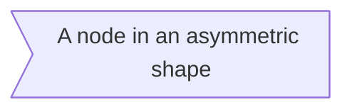

<div>
    <h1 style="font-size:50px;text-align:center">
        你能看到这篇文章的原因
    </h1>
    <p style="text-indent:2em">
        首先感谢 Typora 给予了我这一次翻译的兴趣方向，当我发现国内并没有一个结合 Typora 且成体系的 Mermaid 可视化文档时，我是失落的，但是在我翻阅了各个网站之后，答案都指向了<a href="https://mermaid-js.github.io/mermaid/#/">Mermaid</a>，也许你还不知道什么是Mermaid，如果你能看到这一篇文档，那么就说明你应该接触过 Typora ，如果告诉你其实 Typora 里面内置了画图的功能且非常好实现，你会去试试吗？
    </p>
    <p style="text-indent:2em">
        我是一名英语小白，本想通过各大翻译器进行简单复制粘贴，但是在这一过程中我发现，文档中的 Mermaid 的一些功能并不适用于 Typora ，也就是说这篇文档本就不是为 Typora 所打造的，索性我凭借着对这一功能的遐想将这一篇文章用通俗的话给翻译了出来。
    </p>
    <h2 style="font-size:40px;text-align:center">
        致谢
    </h2>
    <p style="text-indent:2em">
        感谢 Mermaid 的开发人员以及 Typora 的开发人员，如果没有你们就没有这一篇文章的出现。如果文档有疑问，错误或者不足之处，请在文档底部获取译者的联系方式，一起探讨。
    </p>
</div>


# 1.Mermaid 功能

**Mermaid可以让我们使用文本和代码创建图表和可视化效果：**

**它主要包括以下图像的创建：**
$$
\textbf{Mermaid}\begin{cases}
\bold{Flowchart-流程图} \\ 
\bold{Sequence\ Diagram-时序图} \\ 
\bold{Class\ Diagram-类图} \\
\bold{State\ Diagram-状态图} \\
\bold{Entity\ Relationship\ Diagram-实体关系图} \\
\bold{User\ Journey-用户行程图} \\
\bold{Gantt-甘特图} \\
\bold{Pie\ Chart-饼状图} \\
\bold{Requirement\ Diagram-需求图} \\
\bold{Other\ Examples\cdots}
\end{cases}
$$


# 2.Mermaid介绍

- **它是一种基于 `JavaScript` 的图表和图表工具，可呈现受 `Markdown` 启发的文本定义以动态创建和修改图表**

- **而在 `typora` 中我们可以输入 ````mermaid` 然后敲击回车，即可初始化一张空白的图。**


# 3.流程图(Flowchart)

- **所有流程图都由节点、几何形状和边缘、箭头或线条组成。 `Mermaid` 代码定义了这些节点和边的生成和交互方式。**
- **它还可以容纳不同的箭头类型、多向箭头以及与子图的链接。**

## 3.1.节点

**例如下：**


```txt
flowchart LR
	id
```

- **这个节点名为 `id` ，被展示到了这个盒子里。**

## 3.2.文本节点

**例如下：**


```txt
flowchart LR
	id1[This is the text in the box]
```

- **可以用`[]`的形式将文本内容框在`box1`当中，随后外层的`box1`就成为了一个定义语句。**

## 3.3.图形

- **这个模块会声明流程图的方向。**
- **下例声明该流程图是从上到下的（TD 或者 TB）。**

**例如下：**


```txt
flowchart TD
	start-->continue-->finally
```


```txt
flowchart TD
	id1(start)-->id2(continue)-->id3(finally)
```


```txt
flowchart TD
	id1(start)
	id2(continue)
	id3(finally)
	id1-->id2-->id3
```

## 3.4.流程图方向

$$
\begin{cases}
TB - \textbf{从上到下}（Top \  To \  Bottom）
\\\\
TD - \textbf{从上到下}（Top \ To \ Down）
\\\\
BT - \textbf{从下到上}（Bottom \ To \ Top）
\\\\
RL - \textbf{从右到左}（Right \ To \ Left）
\\\\
LR -\textbf{从左到右}（Left \ To \ Right）
\end{cases}
$$

## 3.5.节点形状

1. **圆角：**


```txt
flowchart LR
id(A node with round edges)
```

2. **圆边：**


```txt
flowchart LR
id([A stadium-shaped node])
```

3. **子程序框：**


```txt
flowchart LR
id[[A node in a subroutine shape]]
```

4. **圆柱节点：**


```txt
flowchart LR
id[(A Database)]
```

5. **圆形：**


```txt
flowchart LR
id((The sentence in the circle))
```

6. **标签图：**



```txt
flowchart LR
id>A node in an asymmetric shape]
```

7. **菱形:**


```txt
flowchart LR
id{A rhombus}
```

8.  **六边形：**


```txt
flowchart LR
id{{A hexagon node}}
```

9. **平行四边形：**


```txt
flowchart LR
id[/Parallelogram/]
```

10. **平行四边形（反）：**


```txt
flowchart LR
id[\Parallelogram alt\]
```

11. **梯形：**


```
flowchart LR
id[/Trapezoid\]
```

12. **梯形（反）：**


```txt
flowchart LR
id[\Trapezoid alt/]
```

## 3.6.线条

1. **箭头线条：**


```txt
flowchart LR
a-->b
```

2. **正常线条：**


```txt
flowchart LR
a---b
```

3. **字段线条：**


```txt
flowchart LR
a--this is a sentence!---b
c--this is a sentence!-->d
```

```mermaid
flowchart LR
a---|this is a sentense!|b
c-->|this is a sentense!|d
```

```txt
flowchart LR
a---|this is a sentense!|b
c-->|this is a sentense!|d
```

4. **虚线条：**

```mermaid
flowchart LR
a-.--b
c-.->d
e-.text.-f
g-.text.->h
```

```txt
flowchart LR
a-.--b
c-.->d
e-.text.-f
g-.text.->h
```

5. **加粗线条：**

```mermaid
flowchart LR
a==>b
c==text==>d
```

```txt
flowchart LR
a==>b
c==text==>d
```

6. **连接线：**

```mermaid
flowchart LR
a--text1-->b--text2---c
d--- e & f ---g
h--> i & j -->k
l & m --> n & o --- p & q
```

```txt
flowchart LR
a--text1-->b--text2---c
d--- e & f ---g
h--> i & j -->k
l & m --> n & o --- p & q
```

<center><b>其实可以一步一步来</b></center>

```mermaid
flowchart LR
a-->c
a-->d
b-->c
b-->d
c---e
d---e
c---f
d---f

```

```txt
flowchart LR
a-->c
a-->d
b-->c
b-->d
c---e
d---e
c---f
d---f
```

7. **特殊线条：**

```mermaid
flowchart  LR
a--ob--xc
d o--o e <--> f x--xg
```

```txt
flowchart  LR
a--ob--xc
d o--o e <--> f x--xg
```

**8.线条的长短：**

- **线条长短可以用额外的破折号来实现：**

```mermaid
flowchart TD
a(Start)
b{Is it ?}
c[OK]
d[Rethink]
e[End]
a-->b
b--Yes-->c-->d-->b
b--No---->e
```

```txt
flowchart TD
a(Start)
b{Is it ?}
c[OK]
d[Rethink]
e[End]
a-->b
b--Yes-->c-->d-->b
b--No---->e
```

- **这里需要看看代码， `a,b,c,d,e` 依次降级（高度依次下降），`d`到`e`需要降两级，所以加了两条破折号。**

- **注意线条的长度可能会超过渲染引擎的请求等级，简而言之应该有限设置。**

9. **总结：**

|     **长度**     |   **1**    |    **2**    |    **3**     |
| :--------------: | :--------: | :---------: | :----------: |
|   **正常线条**   | **`---`**  | **`----`**  | **`-----`**  |
|   **箭头线条**   | **`-->`**  | **`--->`**  | **`---->`**  |
|   **加粗线条**   | **`===`**  | **`====`**  | **`=====`**  |
| **加粗箭头线条** | **`==>`**  | **`===>`**  | **`====>`**  |
|     **虚线**     | **`-.-`**  | **`-..-`**  | **`-...-`**  |
|   **箭头虚线**   | **`-.->`** | **`-..->`** | **`-...->`** |

## 3.7.转义字符的实体代码

- **可以将文本放在引号内以呈现更麻烦的字符。如下例所示：**

```mermaid
flowchart LR
id1["This is the(text) in the box"]
```

```txt
flowchart LR
id1["This is the(text) in the box"]
```

- **但是我们要转义特殊的字符：**

```mermaid
flowchart LR
A["A double quote: #quot;"]-->B[">:#gt;"]-->C["<:#lt;"]-->D["#:#35;"]-->E["#copy;:#copy;"]
```

```txt
flowchart LR
A["A double quote: #quot;"]-->B[">:#gt;"]-->C["<:#lt;"]-->D["#:#35;"]-->E["#copy;:#copy;"]
```

- **可以看出这里是支持`HTML5`的字符名称的。**


## 3.8.子图

**示例：**

```txt
flowchart LR
	subgraph title
		graph definition
		···
	end
	subgraph title
		graph dedinition
		···
	end
	···
```

**我们来写一个我家和舅舅家的一个关系图：**

```mermaid
flowchart TB
subgraph grandfamily
grandfather<--couple-->grandmather
end
subgraph myfamily
mymather-- mather-->me
myfather-->me
end
subgraph unclefamily
myuncle-->mycousin
myaunt-->mycousin
end
mymather-- sister -->myuncle
me-- brother -->mycousin
myuncle<-- couple -->myaunt
mymather<--couple-->myfather
grandmather--mather-->mymather & myuncle
grandfather--father-->mymather & myuncle
```

```txt
flowchart TB
subgraph grandfamily
grandfather<--couple-->grandmather
end
subgraph myfamily
mymather-- mather-->me
myfather-->me
end
subgraph unclefamily
myuncle-->mycousin
myaunt-->mycousin
end
mymather-- sister -->myuncle
me-- brother -->mycousin
myuncle<-- couple -->myaunt
mymather<--couple-->myfather
grandmather--mather-->mymather & myuncle
grandfather--father-->mymather & myuncle
```

**当然也可以序数三个家庭之间的关系：**

```mermaid
flowchart TB
subgraph grandfamily
grandfather<--couple-->grandmather
end
subgraph myfamily
mymather-- mather-->me
myfather-->me
end
subgraph unclefamily
myuncle-->mycousin
myaunt-->mycousin
end
grandfamily-- parent -->myfamily
grandfamily-- parent -->unclefamily
myfamily<--sister and brother-->unclefamily
```

```txt
flowchart TB
subgraph grandfamily
grandfather<--couple-->grandmather
end
subgraph myfamily
mymather-- mather-->me
myfather-->me
end
subgraph unclefamily
myuncle-->mycousin
myaunt-->mycousin
end
grandfamily-- parent -->myfamily
grandfamily-- parent -->unclefamily
myfamily<--sister and brother-->unclefamily
```

**当然啦，既然`flowchart`中可以嵌入`subgraph`，那么`subgraph`里面也可以嵌入`graph`呀！**

```mermaid
flowchart TB
subgraph grandfamily
	grandfather<--couple-->grandmather
	subgraph unclefamily
		myuncle-->mycousin
		myaunt-->mycousin
	end
	subgraph myfamily
		mymather-- mather-->me
		myfather-->me
	end
end
mymather-- sister -->myuncle
me-- brother -->mycousin
myuncle<-- couple -->myaunt
mymather<--couple-->myfather
myfamily<--sister and brother----->unclefamily
grandmather--mather-->mymather & myuncle
grandfather--father-->mymather & myuncle
```

```txt
flowchart TB
subgraph grandfamily
	grandfather<--couple-->grandmather
	subgraph unclefamily
		myuncle-->mycousin
		myaunt-->mycousin
	end
	subgraph myfamily
		mymather-- mather-->me
		myfather-->me
	end
end
mymather-- sister -->myuncle
me-- brother -->mycousin
myuncle<-- couple -->myaunt
mymather<--couple-->myfather
myfamily<--sister and brother----->unclefamily
grandmather--mather-->mymather & myuncle
grandfather--father-->mymather & myuncle
```

## 3.10.样式和类

1. **节点样式：**

```mermaid
flowchart LR
id1(Start)
id2(Stop)
style id1 fill:#f9f,stroke:#000,stroke-width:4px
style id2 fill:#ccc,stroke:#f66,stroke-width:5px,color:#fff,stroke-dasharray:5 5
id1<---->id2
```

```txt
flowchart LR
id1(Start)
id2(Stop)
style id1 fill:#f9f,stroke:#000,stroke-width:4px
style id2 fill:#ccc,stroke:#f66,stroke-width:5px,color:#fff,stroke-dasharray:5 5
id1<---->id2
```

**我们对比HTML5的样式来看：**

|    **HTML5样式**     |   **Mermaid样式**    |
| :------------------: | :------------------: |
| **background-color** |       **fill**       |
|      **color**       |      **color**       |
|   **border-color**   |      **stroke**      |
|   **border-width**   |   **stroke-width**   |
|   **border-style**   | **stroke-dasharray** |

2. **JavaScript样式类：**

   **示例如下：**

   ```txt
   flowchart LR
   ···:::class1
   ···:::class2
   ···:::class3
   ···
   classDef class1 fill···
   classDef class2 fill···
   classDef class3 fill···
   ···
   ```

   **例如下：**

   ```mermaid
   flowchart LR
   A:::className1-->B:::className2
   classDef className1 fill:#abc;
   classDef className2 fill:#cba;
   ```

   ```txt
   flowchart LR
   A:::className1-->B:::className2
   classDef className1 fill:#abc;
   classDef className2 fill:#cba;
   ```


# 4.时序图(SequenceDiagram)

- **时序图是一种交互图，它显示了进程如何相互操作以及以何种顺序运行。**
- **注意：`end`是一个会破坏语法的特殊字符，如果`end`的使用不可避免，那就应该用`{},[],()`将其框起来。**

**示例如下：**

```mermaid
sequenceDiagram
Alice->>John:Hello John,how are you?
John-->>Alice:Great!
Alice->>John:See you later!
```

```txt
sequenceDiagram
Alice->>John:Hello John,how are you?
John-->>Alice:Great!
Alice->>John:See you later!
```

## 4.1.句法

1. **参与者：**

   - **参与者可以像本页第一个示例中那样隐式定义。参与者或参与者按在图表源文本中的出现顺序呈现。有时，我们可能希望以不同于他们在第一条消息中出现的顺序显示参与者。可以通过执行以下操作来指定`participant`的出现顺序：**

   ```mermaid
   sequenceDiagram
   participant Alice
   participant Bob
   Alice->>Bob:Hi Bob!
   Bob->>Alice:Hi Alice!
   ```

   ```txt
   sequenceDiagram
   participant Alice
   participant Bob
   Alice->>Bob:Hi Bob!
   Bob->>Alice:Hi Alice!
   ```

2. **缩写：**

   - **参与者可以被设置为一个描述性的标签：**

   ```mermaid
   sequenceDiagram
   participant A as Alice
   participant B as Bob
   A->>B:Hello john,how are you?
   B->>A:Great!
   ```

   ```
   sequenceDiagram
   participant A as Alice
   participant B as Bob
   A->>B:Hello john,how are you?
   B->>A:Great!
   ```

## 4.2.箭头样式

| 类型       | 描述               |
| ---------- | ------------------ |
| **`->`**   | **没有箭头的实线** |
| **`-->`**  | **没有箭头的虚线** |
| **`->>`**  | **带箭头的实线**   |
| **`-->>`** | **带箭头的虚线**   |
| **`-x`**   | **带十字的实线**   |
| **`--x`**  | **带十字的虚线**   |

```mermaid
sequenceDiagram
a->b:s
a-->b:s
a->>b:s
a-->>b:s
a-xb:s
a--xb:s
```

```txt
sequenceDiagram
a->b:s
a-->b:s
a->>b:s
a-->>b:s
a-xb:s
a--xb:s
```

## 4.3.激活

- **一个参与者可以被激活，也可以被屏蔽，`activate`和`deactivate`可以用来声明：**

```mermaid
sequenceDiagram
Alice->>John:Hello John,how are you?
activate John
John-->>Alice:Great
deactivate John
```

```txt
sequenceDiagram
Alice->>John:Hello John,how are you?
activate John
John-->>Alice:Great
deactivate John
```

- **其实我们还可以用一些格式上的缩写，比如通过`+/-`来实现这一功能：**

```mermaid
sequenceDiagram
Alice->>+John:Hello John,how are you?
John->>-Alice:Great!
```

```txt
sequenceDiagram
Alice->>+John:Hello John,how are you?
John->>-Alice:Great!
```

- **激活状态能够实现在相同的参与者身上：**

```mermaid
sequenceDiagram
Alice->>+John:Hello John,how are you?
Alice->>+John:John,can you hear me?
John-->>-Alice:Hi Alice,I can hear you!
John-->>-Alice:I feel great!
```

```txt
sequenceDiagram
Alice->>+John:Hello John,how are you?
Alice->>+John:John,can you hear me?
John-->>-Alice:Hi Alice,I can hear you!
John-->>-Alice:I feel great!
```

## 4.4.笔记

- **我们也可以在时序图旁可以添加笔记，我们可以用`right of` `left of` `over`来实现：**

```mermaid
sequenceDiagram
participant John
participant Alice
Note left of John:Text in note
Note right of Alice:Text in note
Note over Alice,John:Text in note
```

```txt
sequenceDiagram
participant John
participant Alice
Note left of John:Text in note
Note right of Alice:Text in note
Note over Alice,John:Text in note
```

## 4.5.循环

- **我们还可以在时序图中运用循环，示例如下：**

```txt
sequenceDiagram
A->B:···
loop Loop_text
	B->A:···
end
```

```mermaid
sequenceDiagram
Alice->John:Hello John,how are you?
loop EverySecond
	John->Alice:Great！
end
```

```txt
sequenceDiagram
Alice->John:Hello John,how are you?
loop EverySecond
	John->Alice:Great！
end
```

## 4.6.判断

- **我们还可以在时序图中加入判断语句，如下例：**

```
sequenceDiagram
alt Describing_text
	···
else Describing_text
	···
end
```

- **如果`else`语句没有触发，我们还可以给一个反馈，如下例：**

```txt
sequenceDiagram
alt Describing_text
	···
else Describing_text
	···
end
pot Extra_response
	···
end
```

```mermaid
sequenceDiagram
Alice->>Bob:Hello Bob,how are you?
alt is sick
	Bob-->>Alice:Not so good :(
else is well
	Bob-->>Alice:Feeling fresh like a daisy
end
opt Extra_response
	Bob-->>Alice:Thanks for asking
end
```

```txt
sequenceDiagram
Alice->>Bob:Hello Bob,how are you?
alt is sick
	Bob-->>Alice:Not so good :(
else is well
	Bob-->>Alice:Feeling fresh like a daisy
end
opt Extra_response
	Bob-->>Alice:Thanks for asking
end
```

## 4.7.平行线

- 我们可以用一种方式来表示同时发生的事情（平行发生）：

```txt
sequenceDiagram
par [action1]
	···
and [action2]
	···
and [action3]
	···
···
and [actionN]
	···
end
```

- **我们来写一个传递`message`的时序图：**

```mermaid
sequenceDiagram
participant A as Alice
participant B as Bob
participant C as Coco
participant D as Dave
participant E as Eize
par Alice to Bob
	A-->>B:message
and Alice to Coco
	A-->>C:message
end
par Coco to Dave
	C-->>D:message
and Coco to Eize
	C-->>E:message
	par Bob to Dave
		B-->>D:message
	end
end
E->>A:OK
D->>A:OK
C->>A:OK
B->>A:OK
```

```txt
sequenceDiagram
participant A as Alice
participant B as Bob
participant C as Coco
participant D as Dave
participant E as Eize
par Alice to Bob
	A-->>B:message
and Alice to Coco
	A-->>C:message
end
par Coco to Dave
	C-->>D:message
and Coco to Eize
	C-->>E:message
	par Bob to Dave
		B-->>D:message
	end
end
E->>A:OK
D->>A:OK
C->>A:OK
B->>A:OK
```

- **可以看出时序图中的平行并发也能够内嵌。**

## 4.8.背景高亮

- **我们还可以在时序图中设置背景的高亮属性，示例如下：**

```txt
rect rgb(,,)
	···	
end
```

```txt
rect rgba(,,,)
	···
end
```

- **例如下：**

```mermaid
sequenceDiagram
participant Alice
participant Bob
rect rgb(191,223,255)
note right of Alice:Alice calls Bob.
Alice->>+Bob:Hello Bob, how are you?
rect rgba(200,150,255,.5)
Alice->>+Bob:Bob,can you hear me?
Bob-->-Alice:Hi Alice,I can hear you!
end
Bob-->>+Alice:I feel great!
end
Alice->>+Bob:I Did you want to go to the game tonight
Bob-->>-Alice:Yeah! See you there.
```

```txt
sequenceDiagram
participant Alice
participant Bob
rect rgb(191,223,255)
note right of Alice:Alice calls Bob.
Alice->>+Bob:Hello Bob, how are you?
rect rgba(200,150,255,.5)
Alice->>+Bob:Bob,can you hear me?
Bob-->-Alice:Hi Alice,I can hear you!
end
Bob-->>+Alice:I feel great!
end
Alice->>+Bob:I Did you want to go to the game tonight
Bob-->>-Alice:Yeah! See you there.
```

## 4.9.注释

- **在`Mermaid`中的注释是由`%%`完成的：**

```mermaid
sequenceDiagram
Alice-->>Bob:display!
%%BoB-->>Alice:no display!
```

```txt
sequenceDiagram
Alice-->>Bob:display!
%%BoB-->>Alice:no display!
```

## 4.10.转义字符的实体代码

**例如下：**

```mermaid
sequenceDiagram
A-->>B:I #9829; you !
B-->>A:I #9829; you #infin; times more!
```

```txt
sequenceDiagram
A-->>B:I #9829; you !
B-->>A:I #9829; you #infin; times more!
```


# 5.类图(ClassDiagram)

- **在软件工程中，统一建模语言（UML）中的类图是一种静态结构图，它通过显示系统的类，属性，操作方法以及对象之间的关系来描述系统的结构。**
- **类图是面向对象建模的主要构建块，它用于应用程序结构的一般概念建模，以及将模型转换为编程代码的详细建模，类图也可用于数据建模，类图中的类代表主要元素，应用程序中的交互以及要编程的类。**
- **例如下：**

```mermaid
classDiagram
animal <|-- duck
animal <|-- fish
animal <|-- zebra
animal : +int age
animal : +String gender
animal : +isMammal()
animal : +mate()
class duck{
+String beakColor
+swim()
+quack()
}
class fish{
-int sizeInFeet
-canEat()
}
class zebra{
+bool is_wild
+run()
}
```

```txt
classDiagram
animal <|-- duck
animal <|-- fish
animal <|-- zebra
animal : +int age
animal : +String gender
animal : +isMammal()
animal : +mate()
class duck{
+String beakColor
+swim()
+quack()
}
class fish{
-int sizeInFeet
-canEat()
}
class zebra{
+bool is_wild
+run()
}
```

## 5.1.句法

- **UML提供了表示类成员的机制，例如属性和方法，以及关于它们的附加信息，图中类的单个实例包含三个元素。**
- 1. **顶部：它是类的名称，它以粗体居中打印，第一个字母大写，他还可能包含描述类性质的可选注释文本。**
  2. **中部：它是类的属性，它们是左对齐，第一个字母是小写的（String写法本就如此）。**
  3. **底部：它是类的操作，它们是左对齐，第一个字母是小写的（String写法本就如此）。**

```mermaid
classDiagram
class BankAccount{
+String owner
+Bigdecimal balance
+deposit(amount)
+withdraw(amount)
}
```

```txt
classDiagram
class BankAccount{
+String owner
+Bigdecimal balance
+deposit(amount)
+withdraw(amount)
}
```

## 5.2.定义一个类

- **定义一个类有两种方式，一种是`class ClassName`，另一种是`ClassName <|-- SubClassName`，前者是通过关键字class显式定义，后者是通过两类的关系隐式定义：**

```mermaid
classDiagram
class 1900sharehome
1900ShareHome <|-- Typora
```

```txt
classDiagram
class 1900sharehome
1900ShareHome <|-- Typora
```

- **命名要求：类名是由字母，数字（允许使用unicode）和下划线字符组成。**

## 5.3.定义类的成员

- **UML提供了表示类成员的机制，例如属性和方法，以及关于它们的附加信息。**
- **Mermaid根据括号`()`是否存在来区分属性和函数/方法。那些`()`被视为函数/方法，而其他被视为属性。**
- **定义类成员的方法也有两种：**

```mermaid
classDiagram
class bankaccount{
+String owner
+BigDecimal balance
+deposit(amount)
+withdrawal(amount)
}
```

```txt
classDiagram
class bankaccount{
+String owner
+BigDecimal balance
+deposit(amount)
+withdrawal(amount)
}
```

```mermaid
classDiagram
class BankAccount
BankAccount : +String owner
BankAccount : +BigDecimal balance
BankAccount : +deposit(amount)
BankAccount : +withdrawal(amount)
```

```txt
classDiagram
class BankAccount
BankAccount : +String owner
BankAccount : +BigDecimal balance
BankAccount : +deposit(amount)
BankAccount : +withdrawal(amount)
```

1. **返回类型：可以用返回的数据类型来定义：**

   ```mermaid
   classDiagram
   class BankAccount{
   +String owner
   +BigDecimal balance
   +deposit(amount)int
   +withdrawal(amount)bool
   }
   ```

   ```txt
   classDiagram
   class BankAccount{
   +String owner
   +BigDecimal balance
   +deposit(amount)int
   +withdrawal(amount)bool
   }
   ```

2. **通用类型：可以用通用类型来进行成员的定义，例如`List<int>`,用于字段，参数和返回类型，方法是将类型包含在`~`内，且该方法不支持嵌套：**

   ```mermaid
   classDiagram
   class Class~Shape~{
   int id
   List~int~ position
   setPoints(List~int~ points)
   getPoints() List~int~
   }
   Class : -List~String~ messages
   Class : +setMessages(-List~String~messages)
   Class : +getMessages() List~Sring~
   ```

   ```txt
   classDiagram
   class Class~Shape~{
   int id
   List~int~ position
   setPoints(List~int~ points)
   getPoints() List~int~
   }
   Class : -List~String~ messages
   Class : +setMessages(-List~String~messages)
   Class : +getMessages() List~Sring~
   ```

3. **可视度：对于一些有特殊可视性的类成员，一般把以下元素放置在成员名字之前：**

   |  字符   |    意义    |
   | :-----: | :--------: |
   | **`+`** |  **公开**  |
   | **`-`** |  **私人**  |
   | **`#`** | **受保护** |
   | **`~`** |  **内部**  |

   ```mermaid
   classDiagram
   class ClassName{
   +Public
   -Private
   #Protected
   ~Package/Internal
   }
   ```

   ```txt
   classDiagram
   class ClassName{
   +Public
   -Private
   #Protected
   ~Package/Internal
   }
   ```

## 5.4.定义关系

- **它是一种建立在类和项目图之上，包括特殊的逻辑链接的总称：**

```txt
[ClassA][Arrow][ClassB]
```

- **以下是目前在UML下所支持的关系定义：**

| 样式  |     描述     |
| :---: | :----------: |
| <\|-- | 实心三角箭头 |
|  *--  |   菱形箭头   |
|  o--  | 空心菱形箭头 |
|  -->  |   向量箭头   |
|  --   |     实线     |
|  ..>  | 虚线向量箭头 |
| ..\|> | 虚线三角箭头 |
|  ..   |     虚线     |

```mermaid
classDiagram
classA <|-- classB
classC *-- classD
classE o-- classF
classG <-- classH
classI -- classJ
classK <.. classL
classM <|.. classN
classO .. classP
```

```txt
classDiagram
classA <|-- classB
classC *-- classD
classE o-- classF
classG <-- classH
classI -- classJ
classK <.. classL
classM <|.. classN
classO .. classP
```

- **我们还可以在两个关系之间使用描述性的标签：**

```txt
[ClassA][Arrow][ClassB]:LabelText
```

```mermaid
classDiagram
classA --|> classB : Inheritance
classC --* classD : Composition
classE --o classF : Aggregation
classG --> classH : Association
classI -- classJ : Link(Solid)
classK ..> classL : Dependency
classM ..|> classN : Realization
classO .. classP : Link(Dashed)
```

```txt
classDiagram
classA --|> classB : Inheritance
classC --* classD : Composition
classE --o classF : Aggregation
classG --> classH : Association
classI -- classJ : Link(Solid)
classK ..> classL : Dependency
classM ..|> classN : Realization
classO .. classP : Link(Dashed)
```

- **双向箭头：**

<table border="1" width="100%" height="100%" style="text-align:center;font-family: 微软雅黑;line-height: 2.5;font-weight: bold;">
    <tr>
        <th>样式</th>
        <th>意义</th>
    </tr>
    <tr>
        <td>&lt;|--</td>
        <td>左实心三角箭头实线</td>
    </tr>
    <tr>
        <td>&lt;--</td>
        <td>左向量箭头实线</td>
    </tr>
    <tr>
        <td>--*</td>
        <td>实心菱形箭头实线</td>
    </tr>
    <tr>
        <td>--o</td>
        <td>空心菱形箭头实线</td>
    </tr>
    <tr>
        <td>--|&gt;</td>
        <td>右实心箭头实线</td>
    </tr>
    <tr>
        <td>--&gt;</td>
        <td>右向量箭头实线</td>
    </tr>
    <tr>
        <th>样式</th>
        <th>意义</th>
    </tr>
    <tr>
        <td>&lt;|..</td>
        <td>左实心三角箭头虚线</td>
    </tr>
    <tr>
        <td>&lt;..</td>
        <td>左向量箭头虚线</td>
    </tr>
    <tr>
        <td>..*</td>
        <td>实心菱形箭头虚线</td>
    </tr>
    <tr>
        <td>..o</td>
        <td>空心菱形箭头虚线</td>
    </tr>
    <tr>
        <td>..|&gt;</td>
        <td>右实心箭头虚线</td>
    </tr>
    <tr>
        <td>..&gt;</td>
        <td>右向量箭头虚线</td>
    </tr>
</table>

## 5.5.基数/关系的多重性

- **类图中的多重性或基数表示一个类的实例链接到另一类的一个实体的数量，例如：**
  **一家公司将有一名或多名员工，但每一位员工只为一家公司工作。**
- **多重符号放置在定义关系的末端：**

| **基数选项** |    **意义**    |
| :----------: | :------------: |
|    **1**     |  **只有一个**  |
|   **0..1**   |   **零或一**   |
|   **1..***   | **一个或多个** |
|    *****     |    **许多**    |
|    **n**     |    **n个**     |
|   **0..n**   |  **零到n个**   |
|   **1..n**   |  **一到n个**   |

- **我们将多重符号定义在`**`中：**

```txt
[ClassA]"Number"[Arrow]"Number"[ClassB]:LabelText
```

```mermaid
classDiagram
A"1"--|>"n"B
```

```txt
classDiagram
A"1"--|>"n"B
```

## 5.6.类的注释

- **可以用特定的标记文本来注释类，就像类的元数据一样，清楚地表明其性质。一些常见的注释实例如下：**
  1. `<<Interface>>`表示一个接口类
  2. `<<abstract>>`表示抽象类
  3. `<<Service>>`表示一个服务器
  4. `<<enumeration>>`表示一个举例类
- **用法如下例：**

```mermaid
classDiagram
class ClassName
<<interface>> ClassName
ClassName : Element!
ClassName : Element!()
```

```txt
classDiagram
class ClassName
<<interface>> ClassName
ClassName : Element!
ClassName : Element!()
```

**这是一个比较复杂的用法，下面来一个简单的：**

```mermaid
classDiagram
class ClassName{
<<interface>>
element!
element!()
}
```

```txt
classDiagram
class ClassName{
<<interface>>
element!
element!()
}
```

- **代码的注释：用`%%`进行注释，例如下：**

```mermaid
classDiagram
%% class Classname{
%%red
%%blue()
%%}
class ClassName{
red
blue()
}
```

```txt
classDiagram
%% class Classname{
%%red
%%blue()
%%}
class ClassName{
red
blue()
}
```

## 5.7.设置图表的方向

- **我们可以很清楚的看出，类图中是包含有方向的，所以我们可以设置类图的方向：**

```mermaid
classDiagram
class Student{
-idCard:IdCard
+id()
}
class IdCard{
-id : int
-name : string
+id()
}
class Bike{
-id : int
-name : String
+id()
}
Student --o IdCard : comment
Bike --o IdCard : comment
```

```txt
classDiagram
class Student{
-idCard:IdCard
+id()
}
class IdCard{
-id : int
-name : string
+id()
}
class Bike{
-id : int
-name : String
+id()
}
Student --o IdCard : comment
Bike --o IdCard : comment
```


# 6.状态图

- **状态图是一种在计算机科学和相关领域中用于描述系统行为的图。状态图要求所描述的系统由有限数量的状态组成；有时情况确实如此，而在其他情况下有时这是一个合理的抽象。**
- **Mermaid 可以渲染状态图。语法大体与plantUml 中使用的语法保持一致，因为这将使用户更容易在mermaid 和plantUml 之间共享图表。**

**例如下：**

```mermaid
stateDiagram
[*] --> Still
Still --> [*]
Still --> Moving
Moving --> Still
Moving --> Crash
Crash --> [*]
```

```txt
stateDiagram-v2
[*] --> Still
Still --> [*]
Still --> Moving
Moving --> Still
Moving --> Crash
Crash --> [*]
```

**比较旧的渲染器：**

```txt
stateDiagram
[*] --> Still
Still --> [*]
Still --> Moving
Moving --> Still
Moving --> Crash
Crash --> [*]
```

- **幸运的是，`Typora`能够兼容两者的渲染**

## 6.1.状态

- **一个状态能够以多种方式去声明，最简单的一种声明方式就是单独作为一个`id`描述：**

```mermaid
stateDiagram-v2
s1
```

```txt
stateDiagram-v2
s1
```

- **另外一种方式就是用一个描述来简化`id`：**

```mermaid
stateDiagram-v2
state "This is a state description" as s2
```

```txt
stateDiagram-v2
state "This is a state description" as s2
```

- **再或者我们可以用`：`来引出`id`:**

```mermaid
stateDiagram-v2
s2:This is a state description
```

```txt
stateDiagram-v2
s2:This is a state description
```

## 6.2.状态转换

- **我们通常用`-->`来作为状态转换的语法，当我们要定义两个状态之间的转换时：**

```mermaid
stateDiagram-v2
s1-->s2
```

```txt
stateDiagram-v2
s1-->s2
```

- **我们也可以在状态转换的同时添加一个描述：**

```mermaid
stateDiagram-v2
s1-->s2:This is a transition
```

```txt
stateDiagram-v2
s1-->s2:This is a transition
```

## 6.3.开始和结束

- **在`Mermaid`里面有两个特殊的状态——开始和结束，我们通常用`[*]`来表示它们：**

```mermaid
stateDiagram-v2
[*]-->A
A-->[*]
```

```txt
stateDiagram-v2
[*]-->A
A-->[*]
```

## 6.4.嵌套状态

- **在实际生活中，我们经常运用多维的状态图来描述一个系统内部的状态关系，为了定义复合状态，我们需要使用到一个`state`关键字，后面跟一个`id`和`{}`，例如下：**

```mermaid
stateDiagram-v2
[*]-->A
state A{
	[*]-->S1
	S1-->S2
	S2-->[*]
}
```

```txt
stateDiagram-v2
[*]-->A
state A{
	[*]-->S1
	S1-->S2
	S2-->[*]
}
```

- **我们在来一个多层嵌套：**

```mermaid
stateDiagram-v2 
[*]-->A 
state A {
	[*]-->B
	state B {
		[*]-->C
		state C {
			[*]-->D
			state D {
				[*]-->E
				E-->[*]
			}
		}
	}
}
```

```txt
stateDiagram-v2 
[*]-->A 
state A {
	[*]-->B
	state B {
		[*]-->C
		state C {
			[*]-->D
			state D {
				[*]-->E
				E-->[*]
			}
		}
	}
}
```

- **我么还可以对其进行分支描述：**

```mermaid
stateDiagram-v2
[*]-->First
state First {
	[*]-->F
	F-->[*]
}
First-->Second
state Second {
	[*]-->S
	S-->[*]
}
First-->Third
state Third {
	[*]-->T
	T-->[*]
}
Second-->[*]
Third-->[*]
```

```txt
stateDiagram-v2
[*]-->First
state First {
	[*]-->F
	F-->[*]
}
First-->Second
state Second {
	[*]-->S
	S-->[*]
}
First-->Third
state Third {
	[*]-->T
	T-->[*]
}
Second-->[*]
Third-->[*]
```

## 6.5.选择分支

- **实际生活当中我们经常运用状态图中的选择分支来描述问题，例如下：**

```mermaid
stateDiagram-v2
[*] --> IsPositive
IsPositive --> if_else
if_else --> False: if n<0
if_else --> True: if n>=0
```

```txt
stateDiagram-v2
[*] --> IsPositive
IsPositive --> if_else
if_else --> False: if n<0
if_else --> True: if n>=0
```

## 6.6.叉

- **可以使用 `<<fork>> ` `<<join>>` 在图中指定一个叉：**

```mermaid
stateDiagram-v2
    state fork_state <<fork>>
      [*] --> fork_state
      fork_state --> State2
      fork_state --> State3
      state join_state <<join>>
      State2 --> join_state
      State3 --> join_state
      join_state --> State4
      State4 --> [*]
```

```txt
stateDiagram-v2
    state fork_state <<fork>>
      [*] --> fork_state
      fork_state --> State2
      fork_state --> State3
      state join_state <<join>>
      State2 --> join_state
      State3 --> join_state
      join_state --> State4
      State4 --> [*]
```

## 6.7.添加笔记

```mermaid
stateDiagram-v2
    State1: The state with a note
    %%第一种方法
    note right of State1
        Important information! You can write notes.
    end note
    %%第一种方法
    State1 --> State2
    %%第二种方法
    note left of State2 : This is the note to the left.
    %%第二种方法
```

```txt
stateDiagram-v2
    State1: The state with a note
    %%第一种方法
    note right of State1
        Important information! You can write notes.
    end note
    %%第一种方法
    State1 --> State2
    %%第二种方法
    note left of State2 : This is the note to the left.
    %%第二种方法
```

## 6.8.并发

```mermaid
stateDiagram-v2
    [*] --> Active
    state Active {
        [*] --> A
        A --> B : 123
        B --> A : 123
        --
        [*] --> C
        C --> D : 456
        D --> C : 456
        --
        [*] --> E
        E --> F : 789
        F --> E : 789
    }
```

```txt
stateDiagram-v2
    [*] --> Active
    state Active {
        [*] --> A
        A --> B : 123
        B --> A : 123
        --
        [*] --> C
        C --> D : 456
        D --> C : 456
        --
        [*] --> E
        E --> F : 789
        F --> E : 789
    }
```

## 6.9.注释

- **和以前介绍的一样，我们在`Mermaid`里面用`%%`来进行语句的注释。**


# 7.实体关系图

- **ER 建模的从业者几乎总是将*实体类型*简称为*实体*。例如，`CUSTOMER`实体*类型*将简称为`CUSTOMER`实体。但从技术上讲，实体是实体类型的抽象*实例*，这就是 ER 图所显示的 - 抽象实例，以及它们之间的关系。**
- **例如下：**

```mermaid
erDiagram
customer ||--o{ order : places
order ||--|{ line-item : contains
customer }|..|{ delivery-adderss : uses
```

```txt
erDiagram
customer ||--o{ order : places
order ||--|{ line-item : contains
customer }|..|{ delivery-adderss : uses
```

- **箭头样式：**

| 左箭头 | 右箭头 |          意义          |
| :----: | :----: | :--------------------: |
|  `|o`  |  `o|`  |         零或一         |
|  `||`  |  `||`  |        整好一个        |
|  `}o`  |  `o{`  | 零个或者多个（无上限） |
|  `}|`  |  `|{`  | 一个或者多个（无上限） |

# 8.生活备忘录

- **生活备忘录在`Mermaid`中算是最简单的图了，没有过多的语法，就下面这一个实例就能实现这样一个有趣的图像：**

```mermaid
journey
title My working day
%% section表示选择要做的事情大体方向，其下是事情的各个细节
section Go to work
%% Doing : number : poeple (number代表心情，5为满分，0为最低分)(poeple代表人物)
Make tea:5:Me
Go upstairs:3:Me
Do work:1:Me,Cat
section Go home
Go downstairs:5:Me
Sit down:5:Me
```

```txt
journey
title My working day
%% section表示选择要做的事情大体方向，其下是事情的各个细节
section Go to work
%% Doing : number : poeple (number代表心情，5为满分，0为最低分)(poeple代表人物)
Make tea:5:Me
Go upstairs:3:Me
Do work:1:Me,Cat
section Go home
Go downstairs:5:Me
Sit down:5:Me
```

# 9.甘特图

- **甘特图是一种条形图，由 Karol Adamiecki 于 1896 年首次开发，1910 年代由 Henry Gantt 独立开发，用于说明项目进度和完成任何项目所需的时间。 甘特图说明项目的终端元素和摘要元素的开始日期和完成日期之间的天数。**

## 9.1.简述

- **甘特图将每个计划任务记录为一个从左向右延伸的连续条。 x 轴代表时间，y 轴记录不同的任务及其完成的顺序。**
- **重要的是要记住，当特定于任务的日期、天数或时间集合被“排除”时，甘特图将通过向右扩展相同的天数来适应这些更改，而不是通过在内部创建间隙任务。 **
- **然而，如果排除的日期在两个设置为连续开始的任务之间，则排除的日期将被图形跳过并留空，并且在排除的日期结束后将开始下一个任务。**
- **甘特图可用于跟踪项目完成前所需的时间，但它也可用于以图形方式表示“非工作日”，只需稍作调整。**

```mermaid
gantt
title A Gantt Diagram
dateFormat YYYY-MM-DD
section A
A task : a1,2021-01-01,30d
Another task : after a1,20d
section B
B task : 2021-03-21,40d
Another task : 40d
```

```txt
gantt
title A Gantt Diagram
dateFormat YYYY-MM-DD
section A
A task : a1,2021-01-01,30d
Another task : after a1,20d
section B
B task : 2021-03-21,40d
Another task : 40d
```

## 9.2.句法

```mermaid
gantt
    dateFormat  YYYY-MM-DD
    title       Adding GANTT diagram functionality to mermaid
    excludes    weekends
    %% (`excludes` accepts specific dates in YYYY-MM-DD format, days of the week ("sunday") or "weekends", but not the word "weekdays".)

    section A section
    Completed task            :done,    des1, 2014-01-06,2014-01-08
    Active task               :active,  des2, 2014-01-09, 3d
    Future task               :         des3, after des2, 5d
    Future task2              :         des4, after des3, 5d

    section Critical tasks
    Completed task in the critical line :crit, done, 2014-01-06,24h
    Implement parser and jison          :crit, done, after des1, 2d
    Create tests for parser             :crit, active, 3d
    Future task in critical line        :crit, 5d
    Create tests for renderer           :2d
    Add to mermaid                      :1d
    Functionality added                 :milestone, 2014-01-25, 0d

    section Documentation
    Describe gantt syntax               :active, a1, after des1, 3d
    Add gantt diagram to demo page      :after a1  , 20h
    Add another diagram to demo page    :doc1, after a1  , 48h

    section Last section
    Describe gantt syntax               :after doc1, 3d
    Add gantt diagram to demo page      :20h
    Add another diagram to demo page    :48h
```

```txt
gantt
    dateFormat  YYYY-MM-DD
    title       Adding GANTT diagram functionality to mermaid
    excludes    weekends
    %% (`excludes` accepts specific dates in YYYY-MM-DD format, days of the week ("sunday") or "weekends", but not the word "weekdays".)

    section A section
    Completed task            :done,    des1, 2014-01-06,2014-01-08
    Active task               :active,  des2, 2014-01-09, 3d
    Future task               :         des3, after des2, 5d
    Future task2              :         des4, after des3, 5d

    section Critical tasks
    Completed task in the critical line :crit, done, 2014-01-06,24h
    Implement parser and jison          :crit, done, after des1, 2d
    Create tests for parser             :crit, active, 3d
    Future task in critical line        :crit, 5d
    Create tests for renderer           :2d
    Add to mermaid                      :1d
    Functionality added                 :milestone, 2014-01-25, 0d

    section Documentation
    Describe gantt syntax               :active, a1, after des1, 3d
    Add gantt diagram to demo page      :after a1  , 20h
    Add another diagram to demo page    :doc1, after a1  , 48h

    section Last section
    Describe gantt syntax               :after doc1, 3d
    Add gantt diagram to demo page      :20h
    Add another diagram to demo page    :48h
```

- **我们也可以在已经有计划的项目过程中加入其他的项目：**

```mermaid
gantt
apple : a,2021-01-01,30d
banana : crit,b,2021-01-04,4d
cherry : active,c,after a,7d
dog : d,after b,3d
```

```txt
gantt
apple : a,2021-01-01,30d
banana : crit,b,2021-01-04,4d
cherry : active,c,after a,7d
dog : d,after b,3d
```

- **标题：关键字——`title`**
- **您可以将图表分成不同的部分，例如将项目的不同部分（如开发和文档）分开。为此，请以`section`关键字开始一行并为其命名。（请注意，与整个图表的标题)不同，此名称是必需的。**
- **关键节点：我们还可以在图表里添加关键节点，类似于里程碑，他们表示单一的时刻，用关键字`milestone`来表示：**

```txt
milestone_name milestone : milestone, m, BeginTime, KeepingTime
```

- **如上例，关键节点的确切时间就是：**

$$
TIME=\frac{BeginTime+KeepingTime}{2}
$$

- **实例如下：**

```mermaid
gantt 
dateFormat HH:mm
axisFormat %H:%M
Initial milestone : milestone, m1, 17:49,2min
taska2 : 10min
taska3 : 5min 
Final milestone : milestone, m2, 18:14, 2min
```

```txt
gantt 
dateFormat HH:mm
axisFormat %H:%M
Initial milestone : milestone, m1, 17:49,2min
taska2 : 10min
taska3 : 5min 
Final milestone : milestone, m2, 18:14, 2min
```

## 9.3.设置时间

- **默认格式：`dateFormat YYYY-MM-DD`**
- **其他`Mermaid`支持的格式如下：**

| **输入**      | **样例**           | **描述**                           |
| ------------- | ------------------ | ---------------------------------- |
| **YYYY**      | **2021**           | **四位数年份**                     |
| **YY**        | **21**             | **两位数年份**                     |
| **Q**         | **1……4**           | **季度**                           |
| **M  MM**     | **1……12**          | **月份（数字）**                   |
| **MMM  MMMM** | **January……Dec**   | **月份（英文）**                   |
| **D  DD**     | **1……31**          | **日（月中）**                     |
| **Do**        | **1st……31st**      | **日（英文缩写排序）**             |
| **DDD  DDDD** | **1……365**         | **日（年中）**                     |
| **X**         | **1410715640.579** | **Unix 时间戳**                    |
| **x**         | **1410715640579**  | **Unix ms 时间戳**                 |
| **H  HH**     | **0……23**          | **小时（24时制）**                 |
| **h  hh**     | **1……12**          | **小时（12时制，和a、A搭配使用）** |
| **a  A**      | **am  pm**         | **上、下午**                       |
| **m  mm**     | **0……59**          | **分钟**                           |
| **s  ss**     | **0……59**          | **秒**                             |
| **S**         | **0……9**           | **分秒**                           |
| **SS**        | **0……99**          | **厘秒**                           |
| **SSS**       | **0……999**         | **毫秒**                           |
| **Z  ZZ**     | **+12:00**         | **时差**                           |

- **时间的格式化输出：**

```txt
axisFormat %Y-%m-%d
```

- **其他`Mermaid`所支持的格式化输出：**

```txt
%a - 缩写的工作日名称。
%A - 完整的工作日名称。
%b - 缩写的月份名称。
%B - 完整的月份名称。
%c - 日期和时间，如“%a %b %e %H:%M:%S %Y”。
%d - 十进制数 [01,31] 月份的零填充日期。
%e - 十进制数 [1,31] 的月份中以空格填充的日期；相当于 %_d。
%H - 小时（24 小时制），十进制数 [00,23]。
%I - 小时（12 小时制）作为十进制数 [01,12]。
%j - 以十进制数表示的一年中的第几天 [001,366]。
%m - 十进制数的月份 [01,12]。
%M - 十进制数 [00,59] 的分钟。
%L - 十进制数的毫秒数 [000, 999]。
%p - 上午或下午。
%S - 秒为十进制数 [00,61]。
%U - 一年中的周数（星期日作为一周的第一天）作为十进制数 [00,53]。
%w - 工作日为十进制数 [0(Sunday),6]。
%W - 一年中的周数（星期一作为一周的第一天）作为十进制数 [00,53]。
%x - 日期，如“%m/%d/%Y”。
%X - 时间，如“%H:%M:%S”。
%y - 没有世纪的年份，十进制数 [00,99]。
%Y - 以世纪为十进制数的年份。
%Z - 时区偏移量，例如“-0700”。
%% - 文字“%”字符。
```

# 10.饼状图(Pie)

- **饼图（或圆图）是一种圆形统计图形，它被分成多个切片来说明数字比例。 在饼图中，每个切片的弧长（及其中心角和面积）与其代表的数量成正比。 虽然它因其类似于切片的馅饼而得名，但它的呈现方式有多种变化。**
- **如下例：**

```mermaid
pie title pie_title
"A":50
"B":40
"C":10
```

```txt
pie title pie_title
"A":50
"B":40
"C":10
```

## 10.1.句法

- **在`Mermaid`中画一个饼图是非常容易的：**

**关键字以`pie`开始，随后设置标题`title`，然后将每个标签`Label`用引号`" "`括起来，随后跟上冒号`:`，最后写上该标签所占比例即可。**

```txt
pie 
titie TitleName
"ElementA":numberA
"ElementB":numberB
···
```

## 10.2.例子

```mermaid
pie 
title Mobile Phone
"Sumsung":18.4
"Apple":13.6
"Xiaomi":9.9
"Vivo":7.4
"OPPO":8.0
"Others":42.6
```

```txt
pie 
title Mobile Phone
"Sumsung":18.4
"Apple":13.6
"Xiaomi":9.9
"Vivo":7.4
"OPPO":8.0
"Others":42.6
```
